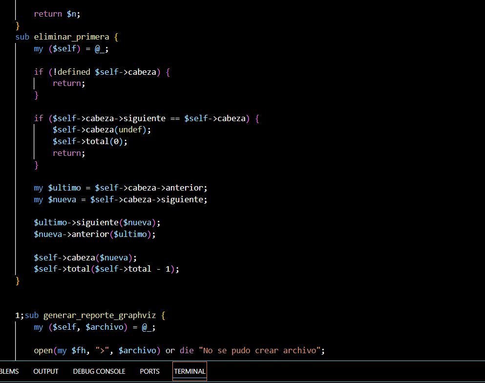
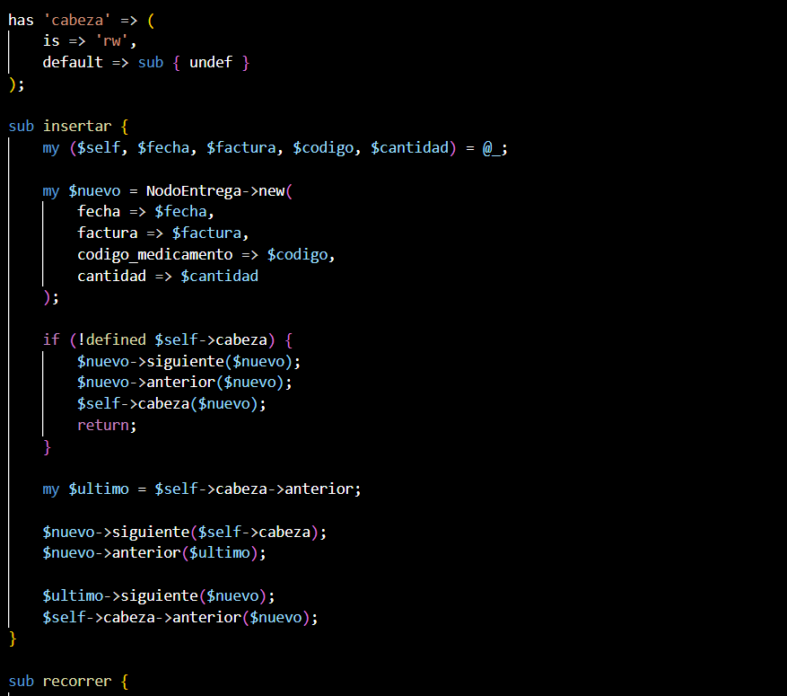
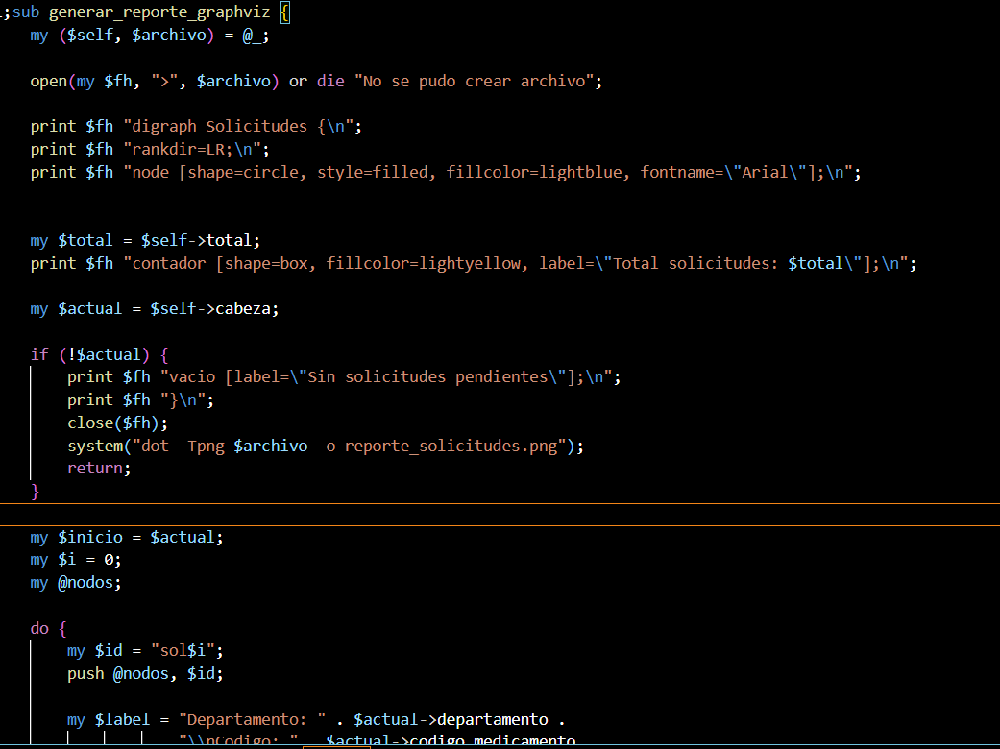
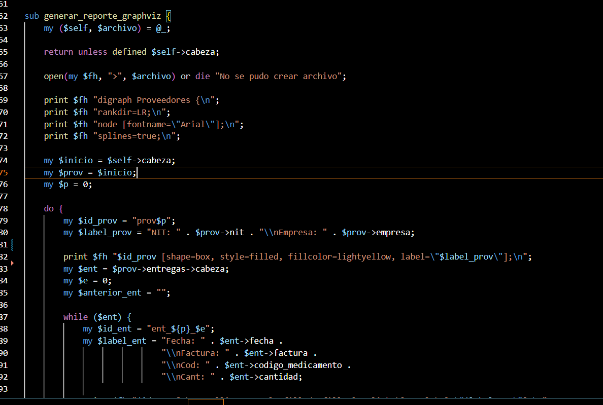
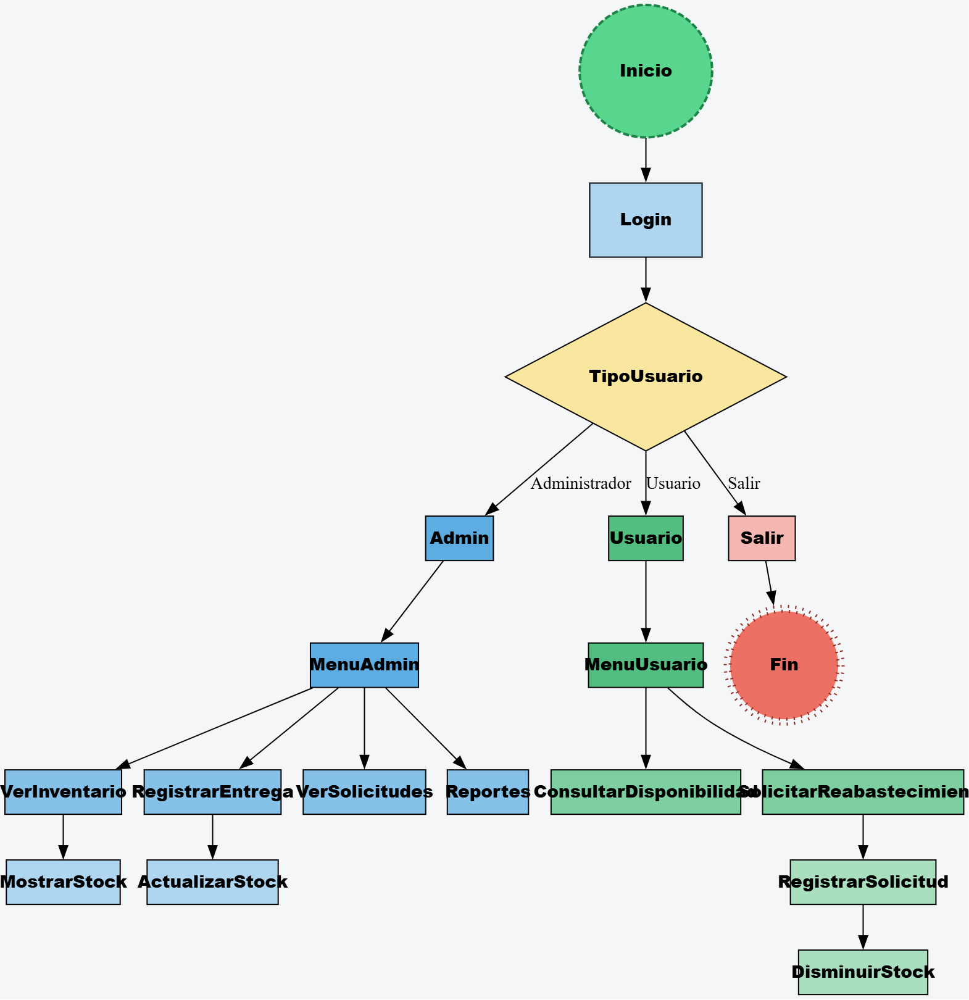

 <div align="center">

#  SISTEMA DE INVENTARIO HOSPITALARIO  

<br>

### Manual Técnico

<br><br>

Univerdidad San Carlos de Guatemala  
Facultad de Ingenieria  
**Curso:** Estructuras de Datos  
** Proyecto 1 – -Fase 1-Implementación de Estructuras Dinámicas** 

<br>

**Estudiante:** NOE YAHIR MAZARIEGOS GRAMAJO  
**Carné:** __202113309   

<br>

**Año:** 2026  

<br><br>

---

<p align="center">
Sistema desarrollado en Perl utilizando estructuras de datos dinamicas y reportes mediante Graphviz.
</p>

</div>

---

# Sistema de Inventario Hospitalario (EDD)


El sistema fue desarrollado en Perl utilizando programación orientada a objetos con el módulo Moo.
Su objetivo principal es gestionar el inventario de medicamentos, solicitudes de reabastecimiento y entregas de proveedores, implementando estructuras de datos dinámicas y generando reportes visuales mediante Graphviz.

El diseño del sistema se basa en la separación modular por estructuras de datos, donde cada estructura representa un componente funcional del sistema hospitalario.

---

# Estructuras de Datos Implementadas

## 1. Lista Doblemente Enlazada (Inventario de Medicamentos)

### Implementación

La estructura del inventario se implementó mediante una lista doblemente enlazada utilizando:

* Clase: `NodoMedicamento`
* Clase: `ListaInventario`

Cada nodo contiene:

* Código del medicamento
* Nombre
* Principio activo
* Laboratorio
* Cantidad disponible
* Fecha de vencimiento
* Precio
* Stock mínimo
* Puntero siguiente
* Puntero anterior

### Funcionamiento

Los medicamentos se insertan mediante el método:

```
insertar_ordenado()
```


Este método mantiene la lista ordenada por código de medicamento, lo cual permite:

* Búsquedas más eficientes
* Reportes ordenados automáticamente
* Mejor control del inventario

### Decisiones de Diseño

Se eligió una lista doblemente enlazada porque:

* Permite recorrer en ambas direcciones (adelante y atrás)
* Facilita la inserción ordenada sin necesidad de reestructurar toda la lista
* Representa de forma clara el flujo del inventario en los reportes Graphviz

Además, se implementaron los métodos:

* `aumentar_stock()` → Incrementa la cantidad al registrar entregas
* `disminuir_stock()` → Reduce el stock al procesar solicitudes
* `buscar()` → Localiza medicamentos por código o nombre

---

## 2. Lista Circular Doblemente Enlazada (Solicitudes Pendientes)

### Implementación

Las solicitudes de reabastecimiento se almacenan en una lista circular doblemente enlazada.

Cada nodo contiene:

* Número de solicitud
* Departamento solicitante
* Código del medicamento
* Cantidad solicitada
* Prioridad
* Punteros siguiente y anterior

### Funcionamiento

La lista es circular, lo que significa que:

* El último nodo apunta al primero
* Permite recorrer continuamente las solicitudes pendientes
* Facilita la simulación de una cola de procesamiento administrativo
* 


El método principal es:

```
procesar_solicitud($inventario)
```

Este método:

1. Verifica si el medicamento existe
2. Comprueba el stock disponible
3. Disminuye el stock si la solicitud es válida
4. Elimina la solicitud procesada de la lista

### Decisiones de Diseño

Se utilizó una lista circular porque:

* Modela correctamente solicitudes en espera
* Permite recorrer sin necesidad de reiniciar punteros
* Evita nodos nulos en extremos de la lista

---

## 3. Lista Circular de Listas (Proveedores y Entregas)

### Implementación

Esta estructura combina:

* Lista circular principal → Proveedores
* Lista circular secundaria → Historial de entregas por proveedor


Clases utilizadas:

* `NodoProveedor`
* `ListaProveedores`
* `ListaEntregas`
* `NodoEntrega`

Cada proveedor contiene:

* NIT
* Nombre
* Lista de entregas asociada

Cada entrega contiene:

* Fecha
* Número de factura
* Código de medicamento
* Cantidad entregada

### Funcionamiento

Cuando se registra una entrega:

1. Se inserta en la lista circular de entregas del proveedor
2. Se actualiza automáticamente el stock del inventario
   mediante `aumentar_stock()`

Esto garantiza sincronización entre proveedores e inventario.

### Decisiones de Diseño

Se eligió una lista circular de listas porque:

* Permite agrupar entregas por proveedor
* Facilita el historial independiente por proveedor
* Representa jerarquías de datos de forma eficiente
* Cumple con el modelo solicitado en el enunciado

---

# Módulo de Reportes con Graphviz

El sistema incluye un módulo especializado para generar reportes visuales en tiempo real utilizando Graphviz.

## Reporte del Inventario

[Reporte Graphiz](repo.png)
Representa la lista doblemente enlazada mostrando:

* Nodos rectangulares con información del medicamento
* Flechas bidireccionales entre nodos
* Indicadores de primero y último elemento
* Código de colores:

  * Rojo: bajo stock
  * Amarillo: próximo a vencer
  * Verde: stock normal

## Reporte de Solicitudes Pendientes

Muestra la lista circular doblemente enlazada con:


* Nodos circulares
* Flechas en ambos sentidos
* Flujo continuo de solicitudes
* Contador total de solicitudes pendientes

## Reporte de Proveedores y Entregas

Visualiza:

* Lista horizontal de proveedores
* Listas verticales de entregas
* Conexiones entre proveedor y su historial

Los reportes se generan automáticamente tras modificaciones en las estructuras.


---

# Arquitectura del Sistema

## Lenguaje y Paradigma

* Lenguaje: Perl
* Paradigma: Programación Orientada a Objetos
* Librería OO: Moo

## Organización Modular

El sistema está dividido en módulos:

* Nodos (estructuras básicas)
* Listas (lógica estructural)
* Reportes (Graphviz)
* Archivo principal `admin.pl` (control del sistema)

Esta separación permite:

* Mayor mantenimiento
* Reutilización de código
* Escalabilidad del sistema

---

# Sincronización de Datos

El diseño asegura coherencia entre estructuras:

* Entregas de proveedor → Aumentan stock
* Solicitudes procesadas → Disminuyen stock
* Inventario → Fuente central de verdad del sistema

Esto evita inconsistencias en el manejo de medicamentos.

---

# Conclusión Técnica

El sistema cumple con los requisitos del proyecto al implementar estructuras dinámicas complejas (lista doblemente enlazada, lista circular doblemente enlazada y lista circular de listas) junto con visualización gráfica mediante Graphviz.

Las decisiones de diseño se enfocaron en:

* Eficiencia en inserción y recorrido
* Representación clara de estructuras
* Modularidad del código
* Actualización automática del estado del sistema

* Anexos (Diagrama de Actividades)
* 

